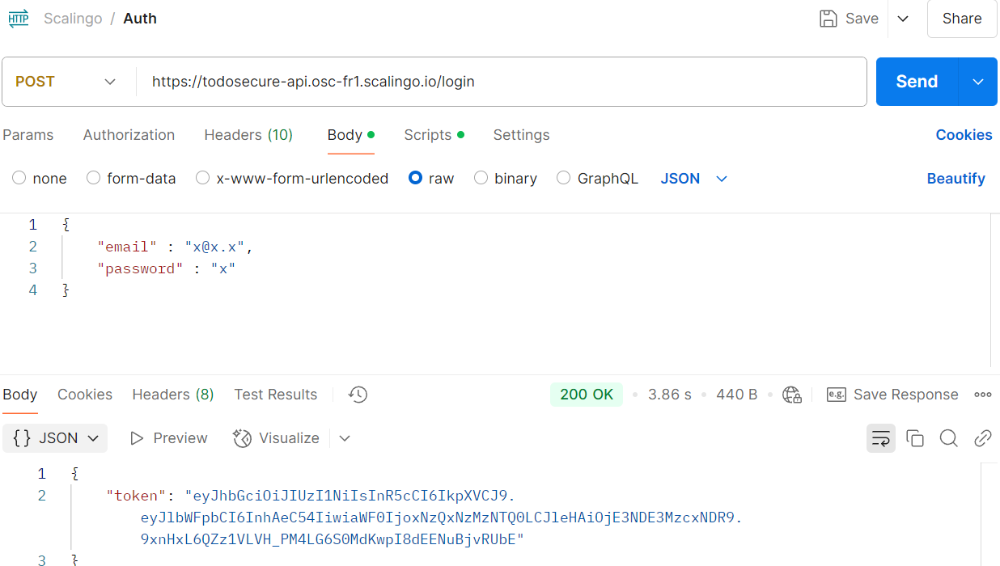

# API de Gestion des Tâches Node.js (Backend)

## Description
API RESTful Node.js dédiée à la gestion efficace des utilisateurs et des tâches, intégrant une sécurité avancée et un déploiement avec Docker et Scalingo.

---

## **Fonctionnalités**
- **Gestion des utilisateurs** :
  - Inscription sécurisée des utilisateurs.
  - Authentification via JSON Web Tokens (JWT).

- **Gestion des tâches (Opérations CRUD)** :
  - Création, lecture, mise à jour et suppression des tâches.
  - Filtrage des tâches par email utilisateur.

- **Sécurité** :
  - Chiffrement des mots de passe avec **bcrypt**.
  - Sécurisation des routes grâce à l'authentification JWT.

---

## **Technologies utilisées**
- **Node.js & Express.js** : Développement rapide d’API RESTful
- **MySQL** : Base de données relationnelle.
- **bcrypt** : Hachage des mots de passe pour la sécurité.
- **JWT (jsonwebtoken)** : Authentification et gestion des sessions.
- **Docker** : Conteneurisation pour simplifier le déploiement.
- **dotenv** : Gestion des variables d'environnement.

---

## Déploiement & Liens

### API (Backend)
- **Production (Scalingo)** :  
  [https://todosecure-api.osc-fr1.scalingo.io](https://todosecure-api.osc-fr1.scalingo.io)  

---

## Installation (en Local)

1. **Cloner le dépôt :**
   ```bash
   git clone https://github.com/smaailhennani-cloud/TodoSecure-API.git
   cd test
   ```

2. **Déploiement avec Docker Compose  :**  
   ```bash
   docker-compose down -v   
   docker-compose up -d --build 
   ```
L'API sera accessible sur : http://localhost:3000.

### Exemple de requête /login

Envoyez une requête POST à /login avec le JSON suivant :

```json
{
  "email": "x@x.x",
  "password": "x"
}
```
Exemple de réponse (200 OK) :
```json
{
  "token": "eyJhbGciOiJIUzI1NiIsInR5cCI6IkpXVCJ9..."
}
```

Capture d'écran Postman :   




### Endpoints de l'API : 


#### Utilisateurs

| Méthode | Route                | Description                   | Paramètres attendus
|---------|----------------------|-------------------------------|-------------------------
| POST    | `/users`             | Créer un utilisateur          | `{ "email": "...", "password": "..." }`
| POST    | `/login`             | Connexion utilisateur (JWT)   | `{ "email": "...", "password": "..." }`


#### Tâches (todos)

| Méthode | Route                | Description                   | Paramètres attendus
|---------|----------------------|-------------------------------|-------------------------
| GET     | `/todos`             | Récupérer les taches          | `?userEmail=...` (optionnel pour filtrer par utilisateur)    
| POST    | `/todos`             | Créer une nouvelle tâche      | `{ "title": "...", "description": "...", "userEmail": "..." }`   
| PUT     | `/todos/:id`         | Modifier une tâche existante  | `{ "title": "...", "description": "...", "done": true/false }`     
| DELETE  | `/todos/:id`         | Supprimer une tâche           | Aucun paramètre


## Voir aussi
- Front-end (TodoApp) :  
[Démo en ligne](https://smaail-hennani.github.io/todoApp/login) | [Code source](https://github.com/smaail-hennani/todoApp/tree/finalAPP)  

## Contact
** Smaail ** – Développeur Angular & Node.js Fullstack
- Email : smaail.hennani@gmail.com
- LinkedIn : www.linkedin.com/in/smaail-hennani-3a0494117

## Licence
Ce projet est disponible sous licence MIT. Voir le fichier LICENSE pour plus d'informations.
